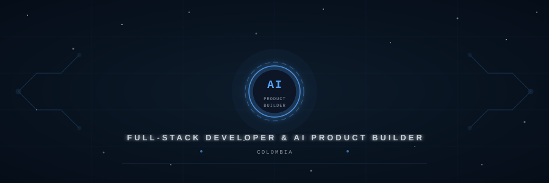

p>

## **Juan Esteban Patiño**
**Full-Stack Developer | AI Product Builder | Colombia**

p>

I build **complete products end-to-end** — from AI agents and logistics platforms to e-commerce stores and healthcare tools. I take ideas from zero to production, combining **modern frontend interfaces**, **robust backend architectures**, and **intelligent systems** powered by LLMs.

My engineering stack is built for **real-world scale and delivery**. I work with **React, Next.js, Vue, and TypeScript** on the frontend, **FastAPI, Go, Node.js** on the backend, and **LangChain, OpenAI, and n8n** to ship intelligent agents and automation workflows that solve actual business problems.

I design data layers using **PostgreSQL, MySQL, Supabase, and ChromaDB**, choosing the right tool based on structure, scale, and intelligence requirements. I integrate **RAG pipelines**, voice agents, and multi-tenant SaaS architectures — packaging everything with **Docker** and structured CI/CD for consistent, reliable deployments.

This profile reflects my approach to software: **build products that work in production**, not just in demos. Clean interfaces backed by powerful logic, intelligent pipelines, and a relentless focus on shipping things that matter.

---

**What I Build**

- Full-stack products with React, Next.js, Vue, TypeScript, FastAPI, Go, and Node.js.
- - AI agents and RAG pipelines with LangChain, OpenAI, ChromaDB, and n8n automation.
  - - Multi-tenant SaaS platforms with async microservices, RabbitMQ, and Go API gateways.
    - - Production-grade deployments containerized with Docker and backed by PostgreSQL and Supabase.
     
      - ---

      **Featured Projects**

      **🪐 Jupiter Platform** — Multi-tenant SaaS with Go API Gateway, Python AI Workers, async queues via RabbitMQ, and full LLM integrations. Built as a collaborative platform for real teams.

      **🛍️ Olfatif** — Wholesale perfume distribution platform with quotations, client management, production analytics and AI-assisted workflows. Next.js · FastAPI · Supabase.

      **🤖 Eden Bot** — AI customer service agent for a language academy. RAG pipeline over course documents deployed on Telegram via n8n. LangChain · ChromaDB · Node.js.

      **🎙️ VoiceAgent** — Real-time AI voice assistant with GPT-4o, STT/TTS, web search and currency conversion. Full-stack FastAPI + React.

      **🚚 305 Express** — Logistics route management platform with 598 automated tests, production-ready. Vue 3 · FastAPI · Expo mobile.

      ---

      
      
